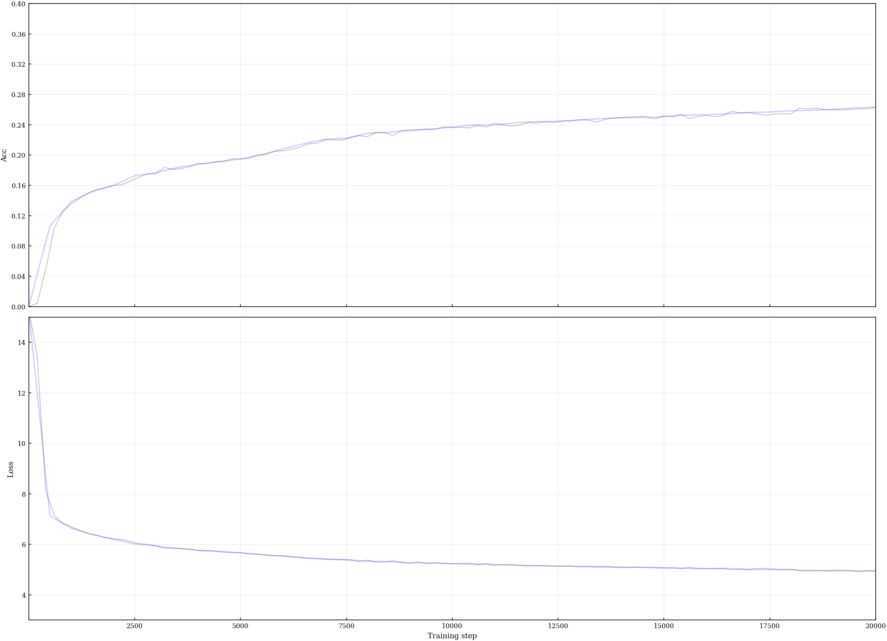
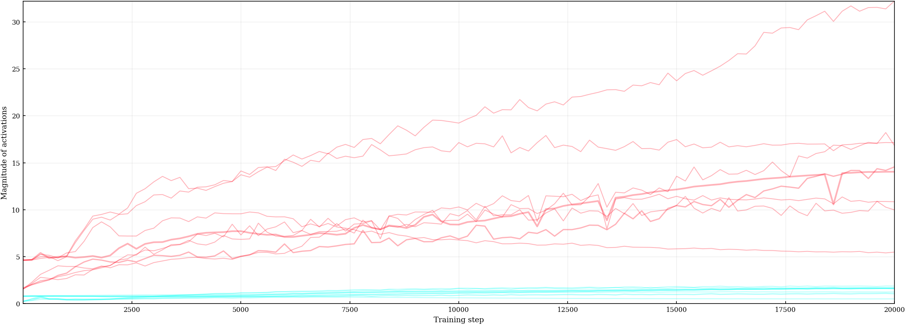
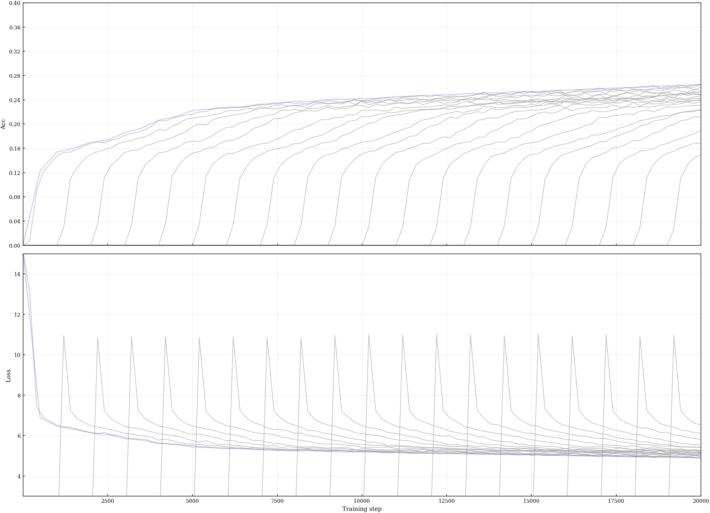
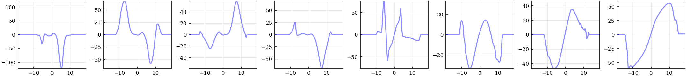

LM-AFs: Language models with learned activation functions
=========================================================

This repository is the official implementation of language models with learnable activation functions used in the following papers:
- [1] *[Can transformers Really Do It All? On the Compatibility of Inductive Biases Across Tasks](https://arxiv.org/search/cs?searchtype=author&query=Teney,+D)*, ICLR, 2026.
- [2] *Better Language Models Require Better Domain-Specific Inductive Biases*, Under review, 2026.

The code implements a transformer similar to the 
[Modded-NanoGPT speedrun](https://github.com/KellerJordan/modded-nanogpt/pull/38),
apart from a few components such as 
the Muon optimizer and layer-specific learning rates.
We avoid these because we noticed that they produce unusual behaviour in internal activations (extremely large and unstable values).

Our contribution on top of this model is to use **learnable activation functions** (linear splines)
in both MLPs (in lieu of GeLUs) and attention blocks (prior to the QKV projections).
Our experimental setup uses 2 stages.
- **In stage I, we discover new activation functions**, by training multiple models in parallel that share learnable activation functions. These are optimized alongside other model weights (typically with a larger learning rate). The multiple models act as a regularizer and ensure that the learned activation functions will be reusable (rather than co-adapting to the weights of one specific model).

- **In stage II, we train new models comparable to the baseline** (with similar capacity and compute). We train a new model from scratch in a standard manner, except for the activation functions that are loaded from stage I (and now frozen). This model is a fair comparison to a baseline model since only a handful of parameters are transferred from stage I. This model can also be trained on a different dataset than used for stage I.

**Benefits.** We get small but consistent improvements over baselines in many cases,
yet the goal is not to directly push the state of the art in LLMs.
Our setup serves as a tool in [1,2] to evaluate the compatibility of inductive biases across datasets.
Our results also show that standard transformer are not a unique/optimal choice in the space of architectures:
their MLP blocks, for example, can work just as well (or better) with wavelet-like activation functions than with the ubiquitous ReLU-like functions.

## ⚙️ Quick start

The commands below reproduce our improvement on a natural language dataset
([🤗Fineweb](https://huggingface.co/datasets/HuggingFaceFW/fineweb))
with the simplest and most effective setup, described in [2]
(multi-model training with staggered starts, using only the original dataset to train the activation functions,
rather than held-out data).
The commands below train tiny models (<20M parameters) such that they can be reproduced even with a small GPU.

#### 1. Clone & set up environment
```bash
git clone https://github.com/idiap/lm-afs
cd lm-afs
pip install -r requirements.txt
```

#### 2. Download and preprocess the Fineweb dataset
```bash
python preprocessFineweb.py "./data-fineweb10B" --n_shards 8
```
#### 3. Train a baseline model

Train a model with standard GeLU MLPs and softmax attention.
```bash
python trainLmAf.py --seed 0 \
    --afType "gelu;att-linear" \
    --runName "baseline-gelu"
```

#### 4. Train models with new activation functions
Learn new activation functions for both **MLP and attention** blocks, **shared across layers** (the best setting in our experience).
This uses 20 parallel models with staggered starts.
```bash
python trainLmAf.py --seed 1234 \
    --nModels 20 \
    --staggeredStarts 1 \
    --afLayerSpecific 0 \
    --afType "spline;att-spline" \
    --afLr 0.1 \
    --runName "optimizedMlpAtt-layerShared-phase1"
```
Then train a new model using the new activation functions (loaded and now frozen). This resulting model is then comparable to the baseline.
```bash
python trainLmAf.py --seed 0 \
    --afLayerSpecific 0 \
    --afType "spline;att-spline" \
    --afLr 0 \
    --runName "optimizedMlpAtt-layerShared-phase2" --afFileToLoad "./results-fineweb10B/ptAf-optimizedMlpAtt-layerShared-phase1-step20000.pt"
```

#### 5. Variations
Same as above, but learn **layer-specific** activation functions. This can be better for some datasets (usually not for natural language, in our experience).
```bash
python trainLmAf.py --seed 1234 \
    --nModels 20 \
    --staggeredStarts 1 \
    --afLayerSpecific 1 \
    --afType "spline;att-spline" \
    --afLr 0.1 \
    --runName "optimizedMlpAtt-layerSpecific-phase1"
```
```bash
python trainLmAf.py --seed 0 \
    --afLayerSpecific 1 \
    --afType "spline;att-spline" \
    --afLr 0 \
    --runName "optimizedMlpAtt-layerSpecific-phase2" \
    --afFileToLoad "./results-fineweb10B/ptAf-optimizedMlpAtt-layerSpecific-phase1-step20000.pt"
```

Same as above, but train activation functions **only in MLP blocks**.
```bash
python trainLmAf.py --seed 1234 \
    --nModels 20 \
    --staggeredStarts 1 \
    --afLayerSpecific 1 \
    --afType "spline;att-linear" \
    --afLr 0.1 \
    --runName "optimizedMlp-layerSpecific-phase1"
```
```bash
python trainLmAf.py --seed 0 \
    --afLayerSpecific 1 \
    --afType "spline" \
    --afLr 0 \
    --runName "optimizedMlp-layerSpecific-phase2" \
    --afFileToLoad "./results-fineweb10B/ptAf-optimizedMlp-layerSpecific-phase1-step20000.pt"
```

> 🎛️ Other options are possible using the hyperparameters described at the top of [trainLmAf.py](trainLmAf.py).

> 💡 If you want to use learned activation functions in your own models, the most important code is in [activationFunctions.py](activationFunctions.py).

## 📈 Example results

We include the results produced with the above commands in [📂results-fineweb10B/](results-fineweb10B/).

**Baseline.**
The training curves below show the token accuracy and loss on the training (black) and validation splits (blue).
With the approprite flag (```--plottingLevel 3```), we also plot the magnitude of internal activations (max in red, mean in blue; one line per layer, ticker line for the first layer).
This is useful to set the range of the learned activation functions (```afRange```).

[📈tr-baseline-gelu-step020000-00001616-00004616.png](results-fineweb10B/tr-baseline-gelu-step020000-00001616-00004616.png)<br>
[📊act-baseline-gelu-step020000.png](results-fineweb10B/act-baseline-gelu-step020000.png)
[📄log-baseline-gelu.txt](results-fineweb10B/log-baseline-gelu.txt)<br>

<br>
<br>
```
(...)
Step 20000/20000   lossVa 4.9334   accVa 26.3
Step 20000/20000   lossTr 4.9519   accTr 26.3
Step 20000/20000   Activation magnitudes (2): 1.66 1.25 0.51 1.69 1.62 1.87 1.58 1.07
Step 20000/20000   Activation magnitudes (3): 14.04 10.85 5.49 9.98 17.13 16.83 32.21 14.56
```
---

**Learned activation functions.**
Training curves below for phase I (parallel models with staggered starts),
and the learned activation functions for the 4 MLPs and 4 attention layers).

[📈tr-optimizedMlpAtt-layerSpecific-phase1-step020000-00031632-00033550.png](tr-optimizedMlpAtt-layerSpecific-phase1-step020000-00031632-00033550.png)<br>
[📈af-optimizedMlpAtt-layerSpecific-phase1-step020000.png](af-optimizedMlpAtt-layerSpecific-phase1-step020000.png)

<br>


And those learned when shared across layers (MLP on the left, attention on the right).<br>
[📈af-optimizedMlpAtt-layerShared-phase1-step020000.png](af-optimizedMlpAtt-layerShared-phase1-step020000.png)<br>


And the training curves for phase II (fresh new model with frozen activation functions).<br>
[📈tr-optimizedMlpAtt-layerShared-phase2-step020000-00001745-00005106.png](tr-optimizedMlpAtt-layerShared-phase2-step020000-00001745-00005106.png)<br>
[📄log-optimizedMlpAtt-layerShared-phase2.txt](results-fineweb10B/log-optimizedMlpAtt-layerShared-phase2.txt)

<br>
```
(...)
Step 20000/20000   lossVa 4.9006   accVa 26.6
Step 20000/20000   lossTr 4.9189   accTr 26.3
```


## 📝 Citation

If you find this work useful, thanks for citing the [related publications](https://arxiv.org/search/cs?searchtype=author&query=Teney,+D).

```bibtex
@inproceedings{teney2026can,
      title={Can transformers Really Do It All? On the Compatibility of Inductive Biases Across Tasks}, 
      author={Damien Teney and Liangze Jiang and Hemanth Saratchandran and Simon Lucey},
      booktitle={International Conference on Learning Representations (ICLR)},
      year={2026}
}

@inproceedings{teney2026better,
      title={Better Language Models Require Better Domain-Specific Inductive Biases}, 
      author={Damien Teney and Liangze Jiang and Zachary Shinnick and Hemanth Saratchandran and Simon Lucey},
      booktitle={Under review},
      year={2026}
}
```

## 🤝 Contact

For questions, or if you're looking for a feature from our publications that isn't included in this repo, feel free to reach out at [damien.teney@idiap.ch](mailto:damien.teney@idiap.ch).

## ⚖️ License

This project is released under the [MIT License](LICENSE).
